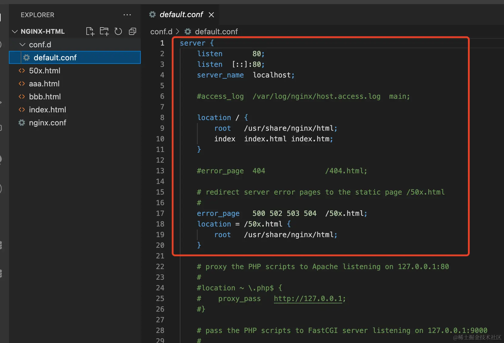
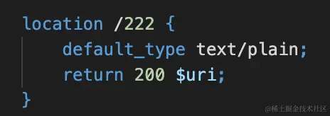
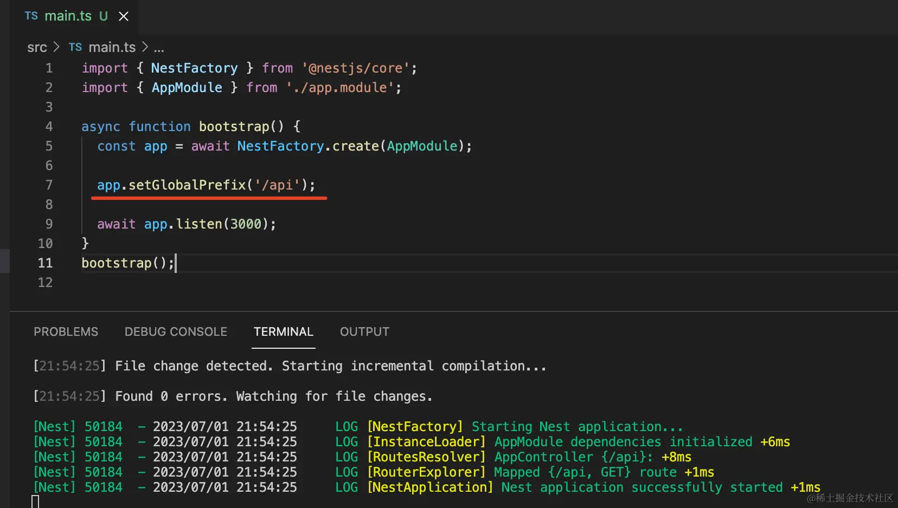
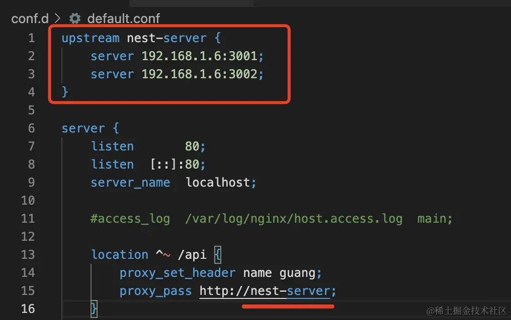
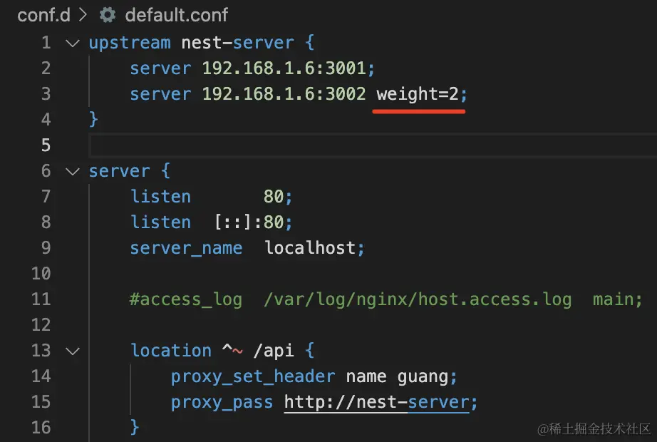
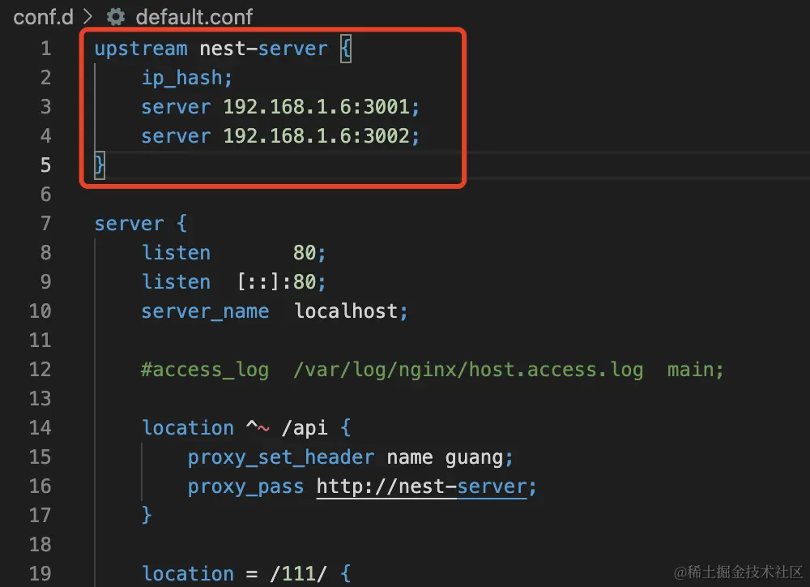

# Nginx 最主要的用法

Nginx 是流行的服务器，一般用于对静态资源做托管、对动态资源做反向代理。只要放到 `/usr/share/nginx/html` 下的文件，都可以
通过被访问到。我们来看下 Nginx 配置文件，也就是 `/etc/nginx/nginx.conf`（默认配置）。

## 什么是虚拟主机？

虚拟主机就是可以用一台 Nginx 服务器为多个域名和端口提供服务。只需要添加多个 `server` 配置就可以实现。



下面的 `location` 就是路由配置。

例如：

```sh
# location 和路径之间加了个 =，代表精准匹配，也就是只有完全相同的 URL 才会匹配这个路由。
location = /111/ {
    default_type text/plain;
    return 200 "111 success";
}
```



更多的 `location` 配置：

```sh
# 不带 = 代表根据前缀匹配，后面可以是任意路径。这里的 $uri 是取当前路径。
location /222 {
    default_type text/plain;
    return 200 $uri;
}

# 然后如果想支持正则，就可以加个 ~。
location ~ ^/333/bbb.*\.html$ {
    default_type text/plain;
    return 200 $uri;
}

# 如果想让正则不区分大小写，可以再加个 *
location ~* ^/444/AAA.*\.html$ {
    default_type text/plain;
    return 200 $uri;
}

# 如果想提高优先级，可以使用 ^~
location ^~ /444 {
    default_type text/plain;
    return 200 'xxxx';
}
```

这 4 种语法的优先级是这样的：精确匹配（=） > 高优先级前缀匹配（^~） > 正则匹配（～ ~\*） > 普通前缀匹配

## root 和 alias 的区别

比如这样的两个配置：

```sh
location /222 {
    alias /dddd;
}

location /222 {
    root /dddd;
}
```

同样是 `/222/xxx/yyy.html`，如果是用 `root` 的配置，会把整个 URI 作为路径拼接在后面。也就是会查找
`/dddd/222/xxx/yyy.html` 文件。

如果是 `alias` 配置，它会把去掉 `/222` 之后的部分路径拼接在后面。也就是会查找 `/dddd/xxx/yyy.html` 文件。

这就是 `root` 和 `alias` 的区别，拼接路径时是否包含匹配条件的路径。

## 配置文件位置

主配置文件在 `/etc/nginx/nginx.conf`，而子配置文件在 `/etc/nginx/conf.d` 目录下。默认的 HTML 路径是
`/usr/share/nginx/html`。

## 正向代理与反向代理

从用户的角度看，方向一致的就是正向，反过来就是反向。

### 反向代理实现

1. 添加一个全局的前缀 `/api` 

2. 改下 Nginx 配置，添加个路由：

```sh
location ^~ /api {
    proxy_pass http://192.168.1.6:3000;
}
```

为什么这么做？Nginx 反向代理可以修改请求、响应信息，比如设置 header。还可以用它实现负载均衡。

改下 Nginx 配置文件： 

在 `upstream` 里配置它代理的目标服务器的所有实例。下面 `proxy_pass` 通过 `upstream` 的名字来指定。

### 负载均衡策略

- 轮询：默认方式。
- weight：在轮询基础上增加权重，也就是轮询到的几率不同。
- ip_hash：按照 IP 的 hash 分配，保证每个访客的请求固定访问一个服务器，解决 session 问题。
- fair：按照响应时间来分配，这个需要安装 `nginx-upstream-fair` 插件。

 


### 使用 nginx 处理跨域

使用 nginx 处理项目部署后的跨域问题
1. 配置前端项目接口地址
```sh
# 在.env.production内，配置接口地址
VITE_GLOB_API_URL=/api
```

2.在 nginx 配置请求转发到后台

```sh

server {
  listen     80;
  server_name  localhost;
  # 接口代理，用于解决跨域问题
  location /api {
    proxy_set_header Host $host;
    proxy_set_header X-Real-IP $remote_addr;
    proxy_set_header X-Forwarded-For $proxy_add_x_forwarded_for;
    # 后台接口地址
    proxy_pass http://localhost:8080/api;
    proxy_redirect default;
    add_header Access-Control-Allow-Origin *;
    add_header Access-Control-Allow-Headers X-Requested-With;
    add_header Access-Control-Allow-Methods GET,POST,OPTIONS;
  }
}  
```