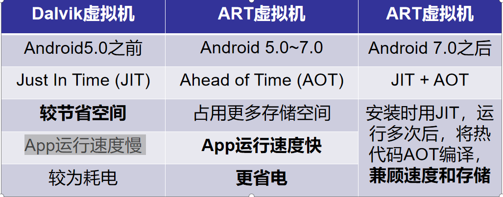

## Android 简介

Android（安卓）是一种基于 Linux 内核的开放源代码操作系统，由 Google 领导的 OHA（Open Handset Alliance，开放手机联盟，有 84 家成员）维护和持续开发。

## Android 系统架构

Android 系统自顶向下分为四层：

1. **应用程序层**（Java）：这是我们正在学习编写的层面，包括应用程序的用户界面和功能。
2. **应用程序程序框架层**（Java）：提供了大量 API，是 Java 应用程序开发的基础。
3. **系统库和 Android 运行时**（C/C++）：提供了需要复杂计算的服务，供上层调用。这包括 ART（Android Runtime）和 Core Libraries。
4. **Linux 内核**（C 语言）：处理安全管理、内存管理、进程管理、底层硬件驱动等底层功能。

## Android 虚拟机

Android 虚拟机是专门为硬件条件受限的移动设备设计的。每个 Android 应用程序运行在一个独立的进程中，拥有自己的 Android 虚拟机实例。这个设计目的在于确保当单个 Android 应用程序崩溃时，系统和其他应用程序不受影响，仍能正常运行。

## Android 开发的特点

- **开发语言和平台**：主要使用 Java，同时也支持 C++，以及未来可能取代 Java 的 Kotlin。
- **开放性**：Android 是开放源代码的，允许开发者自由定制和扩展系统。
- **应用程序间无界限**：Android 应用程序之间可以互相调用、共享数据等，具有较强的互操作性。
- **应用程序开发快速方便**：Android 提供丰富的 API 和开发工具，加速应用程序开发过程。
- **兼容性问题**：由于设备种类众多，Android 开发者需要考虑不同设备的兼容性问题。

## Android 开发语言

- **Java**：是主流的 Android 开发语言，用于编写大部分应用程序的业务逻辑。
- **C++**：用于需要复杂计算和高性能图像渲染的应用程序。
- **Kotlin**：自 2017 年官方宣布后，逐渐成为 Android 开发的首选语言，未来有望取代 Java。

## Dalvik 虚拟机和 ART 虚拟机优缺点

- **Dalvik 虚拟机**：用于早期 Android 版本，优点是在资源受限的设备上效率较高，缺点是运行时性能相对较低。
- **ART 虚拟机**：从 Android 5.0 开始引入，优点是在应用程序安装时将字节码转换为机器码，提升了运行时性能和效率，但增加了应用程序安装时间和存储空间的消耗。

## Android 四大组件

1. **Activity**：用于展示界面并与用户交互的组件。
2. **Service**：用于在后台进行数据处理和计算的组件，可以长期运行作为后台服务。
3. **BroadcastReceiver**：用于监听和接收广播消息的组件，可以在不同的组件和不同的应用之间传递消息。
4. **ContentProvider**：用于跨进程共享数据的组件。
