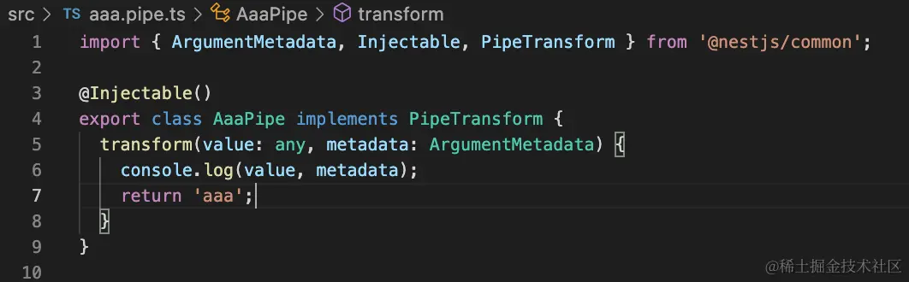
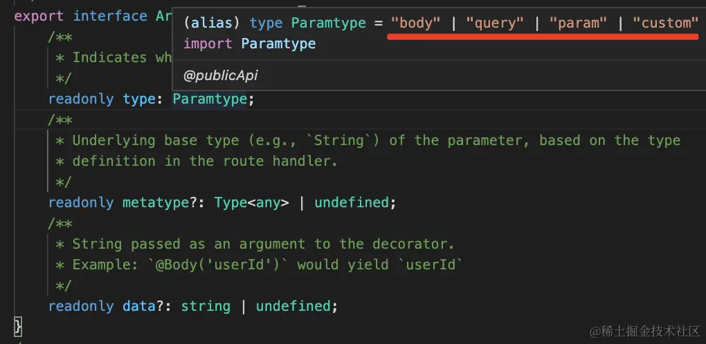
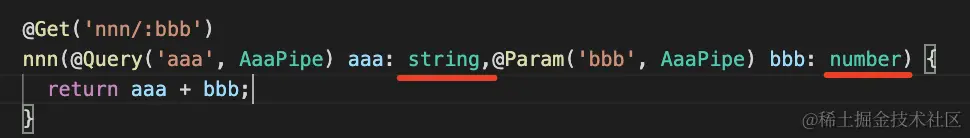

1.Pipe 是在参数传给 handler 之前做一些验证和转换的，有 9 个内置的 Pipe 可以直接用。

我们过了一遍内置的 ParseIntPipe、ParseBoolPipe、ParseArrayPipe、ParseUUIDPipe、ParseEnumPipe、ParseFloatPipe 还有
DefaultValuePipe。

剩下的 ValidationPipe 和 ParseFilePipe 之后的章节讲。

自己写一个 pipe 也很简单，就是实现 PipeTransform 接口的 transform 方法，它的返回值就是传给 handler 的值。

自己写一个自定义的 pipe. 

type 就是 @Query、@Param、@Body 装饰器，或者自定义装饰器： 

而 metatype 是参数的 ts 类型： 

data 是传给 @Query、@Param、@Body 等装饰器的参数。

有了这些东西，做一下验证，抛出异常给 exception filter 处理，或者对 value 做些转换再传给 handler 就都是很简单的事情了。

## 2. 异常处理
