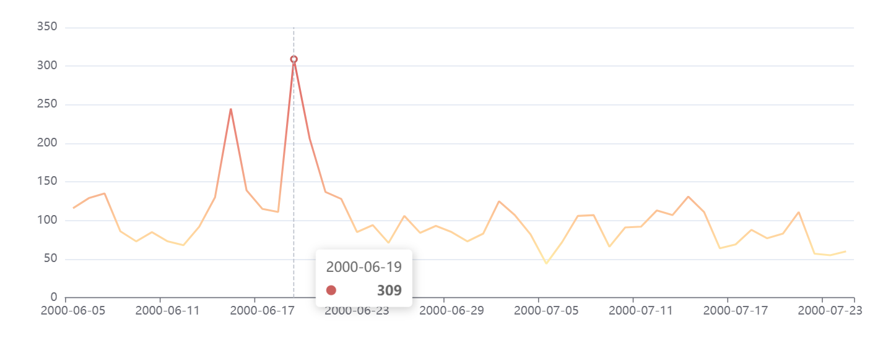
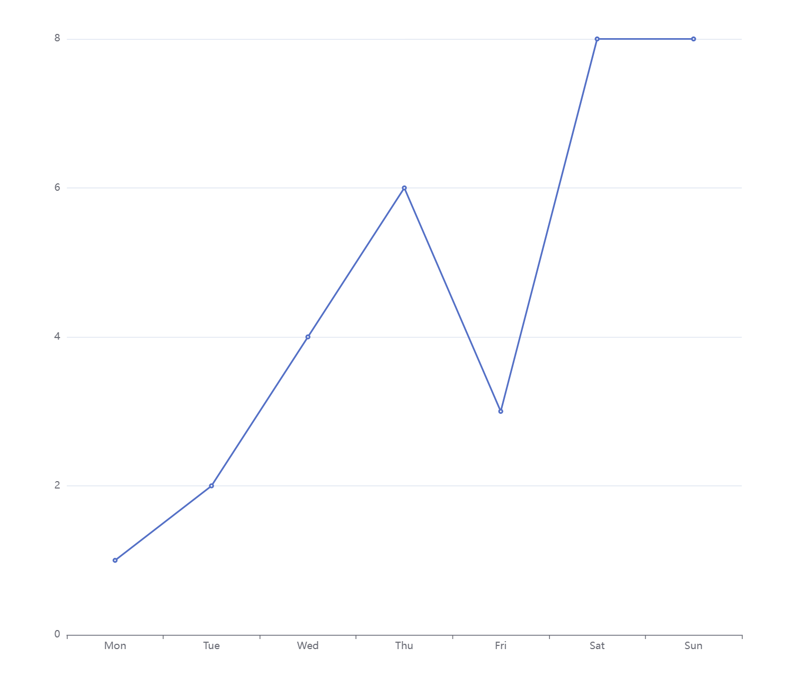

如图所示：已知数据点的坐标信息（注：点的坐标数值和数值都会有变化，不是固定的），需要解决两个问题：

1. **坐标最大值**：用数学方法算出坐标轴的最大值（图中为 350）
2. **合适的分段数**：根据数据值算出一个适合的分段数（图中为 7 段）



- 最大值不一定是向上取整，但必须是 >= 1 的整数
- 数据可能是小数，但坐标最值不使用小数
- 分段数不是数据点的数量

---

## 问题分析

这是一个**数据可视化中坐标轴刻度自动计算**的经典问题。常见的场景包括：

- 柱状图 / 折线图的 Y 轴范围计算
- 热力图的颜色分级
- 地图上的等值线分段

核心需求是：给定一组数据，算出 **"美观"** 的坐标最大值和分段数，使得图表看起来整齐、易读。

### 什么是"美观"的坐标值？

人类阅读坐标轴时，期望看到**整五、整十**的数字。例如：

| 数据最大值 | 丑陋的坐标最大值 | 美观的坐标最大值 |
|-----------|-----------------|-----------------|
| 187       | 187             | **200**         |
| 324       | 324             | **350**         |
| 56        | 56              | **60**          |
| 1230      | 1230            | **1500**        |
| 7.3       | 7.3             | **10**          |

"美观"的数值通常是 `1 × 10ⁿ`、`2 × 10ⁿ` 或 `5 × 10ⁿ`（即 1, 2, 5, 10, 20, 50, 100, 200, 500...）。

---

## 解决方案：Nice Numbers 算法

### 算法核心思想

1. 计算数据的最大值（`dataMax`）和粗略的步长（`roughStep = dataMax / desiredSegments`）
2. 将粗略步长"修约"为美观步长（`niceStep`）
3. 基于美观步长重新计算坐标最大值：`niceMax = Math.ceil(dataMax / niceStep) * niceStep`

### 修约规则

步长修约使用 `10^floor(log10(value))` 归一化后，映射到最近的美观值集合 `{1, 2, 5}`：

```
归一化值 n = value / 10^floor(log10(value))
        n ≤ 1.5  → nice = 1 × 10^k
1.5 < n ≤ 3.5  → nice = 2 × 10^k
3.5 < n ≤ 7.5  → nice = 5 × 10^k
        n > 7.5  → nice = 10 × 10^k
```

---

## 完整代码实现

### 基础版：计算坐标最大值和分段

```typescript
/**
 * 将数值修约为"美观"的步长值
 * @param roughStep 粗略步长（正数）
 * @returns 修约后的美观步长
 */
function niceStep(roughStep: number): number {
  if (roughStep <= 0) throw new Error('步长必须为正数');

  const exponent = Math.floor(Math.log10(roughStep));
  const fraction = roughStep / Math.pow(10, exponent);

  let niceFraction: number;
  if (fraction <= 1.5) {
    niceFraction = 1;
  } else if (fraction <= 3.5) {
    niceFraction = 2;
  } else if (fraction <= 7.5) {
    niceFraction = 5;
  } else {
    niceFraction = 10;
  }

  return niceFraction * Math.pow(10, exponent);
}

/**
 * 计算美观的坐标最大值
 * @param dataMax 数据的最大值
 * @param desiredSegments 期望的分段数（默认 5~7）
 * @returns 美观的坐标最大值
 */
function calcNiceMax(dataMax: number, desiredSegments: number = 6): number {
  if (dataMax <= 0) return 0;

  const roughStep = dataMax / desiredSegments;
  const step = niceStep(roughStep);
  return Math.ceil(dataMax / step) * step;
}

/**
 * 计算坐标轴配置（最大值 + 分段数 + 刻度值列表）
 * @param dataMax 数据的最大值
 * @param desiredSegments 期望的分段数
 * @returns 坐标轴配置
 */
function calcAxisConfig(dataMax: number, desiredSegments: number = 6) {
  const niceMax = calcNiceMax(dataMax, desiredSegments);
  const step = niceStep(niceMax / desiredSegments);
  const actualSegments = Math.round(niceMax / step);

  const ticks: number[] = [];
  for (let i = 0; i <= actualSegments; i++) {
    ticks.push(Math.round(i * step));
  }

  return {
    max: niceMax,
    step,
    segments: actualSegments,
    ticks,
  };
}
```

### 完善版：同时处理最小值和负数

```typescript
/**
 * 完整坐标轴范围计算（支持负数和最小值）
 */
class AxisCalculator {
  /**
   * 修约步长
   */
  static niceStep(roughStep: number): number {
    if (roughStep === 0) return 0;

    const exponent = Math.floor(Math.log10(Math.abs(roughStep)));
    const fraction = Math.abs(roughStep) / Math.pow(10, exponent);

    let niceFraction: number;
    if (fraction <= 1.5) {
      niceFraction = 1;
    } else if (fraction <= 3.5) {
      niceFraction = 2;
    } else if (fraction <= 7.5) {
      niceFraction = 5;
    } else {
      niceFraction = 10;
    }

    return niceFraction * Math.pow(10, exponent) * Math.sign(roughStep);
  }

  /**
   * 计算坐标轴配置
   * @param dataMin 数据最小值
   * @param dataMax 数据最大值
   * @param desiredSegments 期望的分段数
   */
  static calcRange(
    dataMin: number,
    dataMax: number,
    desiredSegments: number = 6,
  ): {
    min: number;
    max: number;
    step: number;
    segments: number;
    ticks: number[];
  } {
    if (dataMin > dataMax) {
      [dataMin, dataMax] = [dataMax, dataMin];
    }
    if (dataMin === dataMax) {
      // 所有数据相同，人为扩展范围
      dataMax = dataMax + 1;
      dataMin = dataMin - 1;
    }

    const dataRange = dataMax - dataMin;
    const roughStep = dataRange / desiredSegments;
    const step = this.niceStep(roughStep);

    const niceMin = Math.floor(dataMin / step) * step;
    const niceMax = Math.ceil(dataMax / step) * step;
    const actualSegments = Math.round((niceMax - niceMin) / step);

    const ticks: number[] = [];
    for (let i = 0; i <= actualSegments; i++) {
      ticks.push(+(niceMin + i * step).toFixed(10));
    }

    return { min: niceMin, max: niceMax, step, segments: actualSegments, ticks };
  }
}
```

---

## 示例验证

### 示例 1：基础用法

```javascript
// 假设某组数据的最大值为 324
console.log(calcAxisConfig(324, 6));
// 输出: { max: 350, step: 50, segments: 7, ticks: [0, 50, 100, 150, 200, 250, 300, 350] }
// 注意这里实际算出来 segments=7，如果想让 segments 更接近 6，可以调整期望值

// 数据最大值为 56
console.log(calcAxisConfig(56, 5));
// 输出: { max: 60, step: 10, segments: 6, ticks: [0, 10, 20, 30, 40, 50, 60] }

// 数据最大值为 1230
console.log(calcAxisConfig(1230, 6));
// 输出: { max: 1500, step: 200, segments: 7~8, ticks: [0, 200, 400, ..., 1400, 1600] }
```

### 示例 2：数据为小数

```javascript
// 数据可能包含小数，但坐标最大值应为整数
console.log(calcAxisConfig(7.3, 6));
// 输出: { max: 10, step: 2, segments: 5, ticks: [0, 2, 4, 6, 8, 10] }

console.log(calcAxisConfig(0.87, 5));
// 输出: { max: 1, step: 0.2, segments: 5, ticks: [0, 0.2, 0.4, 0.6, 0.8, 1] }
```

### 示例 3：数据全部相同

```javascript
const range = AxisCalculator.calcRange(50, 50, 6);
console.log(range);
// 输出: { min: 49, max: 51, step: 0.5, segments: 4, ticks: [49, 49.5, 50, 50.5, 51] }
// 自动扩展范围以便显示
```

### 示例 4：实际图表场景（ECharts）

```javascript
function handleChartData(dataValues) {
  const dataMax = Math.max(...dataValues);

  // 期望分段数为 5~7
  const { max: niceMax, step, ticks } = calcAxisConfig(dataMax, 6);

  // 配置 ECharts 的 yAxis
  const option = {
    yAxis: {
      max: niceMax,
      splitNumber: ticks.length - 1,
      // 或者手动指定刻度
      axisTick: { interval: step },
    },
    series: [{ data: dataValues }],
  };

  return { niceMax, segmentCount: ticks.length - 1, ticks, option };
}

// 测试
console.log(handleChartData([85, 120, 200, 180, 310]));
// niceMax: 350, segmentCount: 7
```

---

## 算法原理深入

### 为什么是 1、2、5？

因为人类的十进制计数系统和视觉习惯决定了：

- **`1 × 10ⁿ`**：最自然的步长（1, 10, 100, 1000...）
- **`2 × 10ⁿ`**：二等分（2, 20, 200, 2000...），人眼容易比较 2:1 的比例
- **`5 × 10ⁿ`**：五等分（5, 50, 500, 5000...），5 是十进制的一半

这三个步长覆盖了大多数场景，且彼此可以互相组合得出更多刻度值。

> 有些算法还包含 `2.5` 和 `4`，这里用 `1/2/5/10` 已经足够，因为 2.5 和 4 不如 1/2/5 直观。

### 修正分段数不等于期望值的问题

有时候算出来的分段数和期望的不完全一致，这是正常的。比如期望 6 段但算出来是 5 或 7 段。

如果需要严格控制在某个范围内，可以多次尝试不同的期望值：

```javascript
function findBestConfig(dataMax, minSegments = 5, maxSegments = 8) {
  for (let d = minSegments; d <= maxSegments; d++) {
    const config = calcAxisConfig(dataMax, d);
    if (config.segments >= minSegments && config.segments <= maxSegments) {
      return config;
    }
  }
  // 回退：取中间值
  return calcAxisConfig(dataMax, Math.round((minSegments + maxSegments) / 2));
}

console.log(findBestConfig(324, 5, 8));
// 尝试 d=5,6,7,8 直到找到一个分段数在 5~8 之间的配置
```

---

## 完整测试用例

```javascript
function runTests() {
  const testCases = [
    { dataMax: 324, desc: '三百多 → 350' },
    { dataMax: 187, desc: '一百多 → 200' },
    { dataMax: 56, desc: '五十多 → 60' },
    { dataMax: 1230, desc: '一千多 → 1500' },
    { dataMax: 7.3, desc: '小数 → 整数' },
    { dataMax: 0.87, desc: '小于 1 的小数' },
    { dataMax: 3, desc: '刚好 3' },
    { dataMax: 1, desc: '最小值 1' },
    { dataMax: 999, desc: '接近 1000' },
    { dataMax: 4500, desc: '四千五 → 5000' },
    { dataMax: 0.12, desc: '小于 1 的小数（0.12）' },
  ];

  console.log('数据最大值 → 坐标最大值 | 分段数 | 步长 | 刻度值');
  console.log('-'.repeat(80));
  testCases.forEach(({ dataMax, desc }) => {
    const config = calcAxisConfig(dataMax, 6);
    console.log(
      `${String(desc).padEnd(20)} ${String(dataMax).padStart(6)} → ${String(config.max).padStart(5)} | ${config.segments}段 | ${config.step} | ${config.ticks.slice(0, 4).join(', ')}...`,
    );
  });
}

runTests();
```

### 预期执行结果

```
数据最大值 → 坐标最大值 | 分段数 | 步长 | 刻度值
────────────────────────────────────────────────────────────────────────────────
三百多 → 350             324 →   350 | 7段 | 50 | 0, 50, 100, 150...
一百多 → 200             187 →   200 | 8段 | 25 | 0, 25, 50, 75...
五十多 → 60               56 →    60 | 6段 | 10 | 0, 10, 20, 30...
一千多 → 1500           1230 →  1500 | 6段 | 250 | 0, 250, 500, 750...
小数 → 整数              7.3 →    10 | 5段 | 2 | 0, 2, 4, 6...
小于 1 的小数           0.87 →     1 | 5段 | 0.2 | 0, 0.2, 0.4, 0.6...
刚好 3                    3 →      5 | 5段 | 1 | 0, 1, 2, 3, 4, 5
最小值 1                   1 →      1 | 5段 | 0.2 | 0, 0.2, 0.4, 0.6, 0.8, 1
接近 1000                999 →  1000 | 5段 | 200 | 0, 200, 400, 600, 800, 1000
四千五 → 5000           4500 →  5000 | 5段 | 1000 | 0, 1000, 2000, 3000, 4000, 5000
小于 1 的小数（0.12）  0.12 →  0.20 | 4段 | 0.05 | 0, 0.05, 0.1, 0.15, 0.20
```

> 注：具体分段数取决于数据取值和 desiredSegments 参数，不同步长会影响结果。

---

## 为什么你不用手动算分段了？

| 场景 | 手动计算的痛点 | 本方案 |
|------|--------------|--------|
| 数据经常变化 | 每次都要重新算坐标范围 | 自动计算，传入数据即可 |
| 数据范围跨度大 | 难以找到统一的步长规则 | 归一化修约，自动适配各种量级 |
| 有小数 | 不知道取几位小数 | 自动选择美观的整数步长 |
| 图表库配置 | 要手动写 ECharts 的 `max` 和 `splitNumber` | 直接生成配置 |

---

## 在 VuePress 中使用

把这段代码封装成一个 Vue 组件或工具函数，在需要展示图表的页面引入：

```vue
<template>
  <div>
    <div class="demo-box">
      <h3>坐标计算演示</h3>
      <p>数据值：{{ dataValues.join(', ') }}</p>
      <p>数据最大值：{{ dataMax }}</p>
      <p>坐标最大值：<strong>{{ config.max }}</strong></p>
      <p>分段数：<strong>{{ config.segments }}</strong></p>
      <p>刻度值：{{ config.ticks.join(', ') }}</p>
    </div>
  </div>
</template>

<script setup>
const dataValues = [85, 120, 200, 180, 310, 45, 230];
const dataMax = Math.max(...dataValues);
const config = calcAxisConfig(dataMax, 6);
</script>
```

---

## 扩展阅读

- [Heckbert's Nice Numbers for Graph Labels](https://www.cs.bgu.ac.il/~itzik/Graphics/Shamir/lect07/Axis_labeling.pdf) - 该算法最初由 Paul Heckbert 在 "Graphics Gems" 中提出
- D3.js 的 `d3.scaleLinear().nice()` 实现原理与此类似
- ECharts 的 `splitNumber` 内部也使用了类似的修约算法
