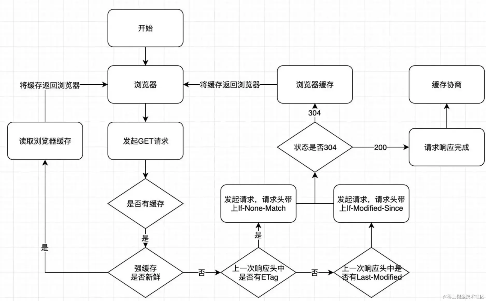
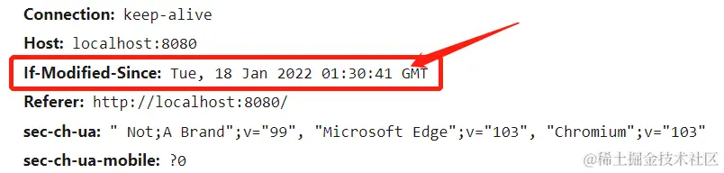

# HTTP 缓存全面指南

## 什么是HTTP缓存？
Web 缓存是可以自动保存常见文档副本的 HTTP 设备。当 Web 请求抵达缓存时，如果本地有"已缓存"的副本，就可以从本地存储设备而不是原始服务器中提取这个文档。

## 缓存解决的问题 vs 缺点

### ✅ 优点
| 优势           | 说明                                 |
| -------------- | ------------------------------------ |
| 节省带宽       | 减少不必要的网络传输，降低流量成本   |
| 加速加载       | 从本地读取资源，大幅提升页面加载速度 |
| 减轻服务器负载 | 避免服务器过载，提高系统稳定性       |

### ❌ 缺点
- 占用内存资源（部分缓存会存储在内存中）

---

## HTTP缓存类型
HTTP缓存分为两种主要类型：

### 1. 强制缓存


**实现方式：**
1. **基于Expires**（已废弃）
   ```http
   Expires: Wed, 30 Jul 2022 23:59:59 GMT
   ```
   - 缺点：依赖本地时间，可能因时间不同步导致缓存失效

2. **基于Cache-Control**（推荐）
   ```http
   Cache-Control: max-age=10
   ```
   - 滑动时间窗口，从第一次响应开始计算
   - 属性说明：

   | 属性     | 说明                       |
   | -------- | -------------------------- |
   | max-age  | 客户端缓存时长（秒）       |
   | s-maxage | 代理服务器缓存时长         |
   | no-cache | 强制协商缓存               |
   | no-store | 禁止任何缓存               |
   | public   | 允许浏览器和代理服务器缓存 |
   | private  | 仅允许浏览器缓存           |

   **组合示例：**
   ```http
   Cache-Control: max-age=10000, s-maxage=200000, public
   ```

### 2. 协商缓存
#### 基于Last-Modified


**实现步骤：**
1. 服务器读取文件修改时间
2. 设置响应头：
   ```http
   Last-Modified: [修改时间]
   Cache-Control: no-cache
   ```
3. 客户端后续请求携带：
   ```http
   If-Modified-Since: [上次的Last-Modified值]
   ```

**缺点：**
1. 修改时间变化但内容未变时仍会失效
2. 毫秒级修改无法检测

#### 基于ETag
**流程：**
1. 服务器计算文件指纹（哈希值）
2. 设置响应头：
   ```http
   ETag: "文件指纹"
   ```
3. 客户端后续请求携带：
   ```http
   If-None-Match: "上次的ETag值"
   ```

**ETag类型：**
| 类型   | 精度       | 性能消耗 |
| ------ | ---------- | -------- |
| 强验证 | 字节级     | 高       |
| 弱验证 | 文件属性级 | 低       |

---

## 缓存实践指南

### 如何设置缓存
- **前端**：通知后端添加响应头
- **后端**：根据资源类型配置适当缓存策略

### 文件缓存策略
| 文件类型                       | 推荐策略 | 原因                 |
| ------------------------------ | -------- | -------------------- |
| 带哈希文件（如main.a1b2c3.js） | 强缓存   | 文件名变化等于新资源 |
| 无哈希文件（如index.html）     | 协商缓存 | 需要及时获取更新     |

**示例：**
```
dist/
├── index.html          # 协商缓存
├── main.a1b2c3.js      # 强缓存
└── style.x4y5z6.css    # 强缓存
```

### 缓存读取位置
| 位置 | 速度 | 示例           |
| ---- | ---- | -------------- |
| 内存 | 最快 | 频繁访问的资源 |
| 磁盘 | 较快 | 不常访问的资源 |

**识别方式：**
- 所有304响应 → 协商缓存
- "从内存/磁盘读取" → 强制缓存

---

## 总结对比表
| 缓存类型 | 实现方式              | 优点     | 缺点         | 适用场景         |
| -------- | --------------------- | -------- | ------------ | ---------------- |
| 强制缓存 | Expires/Cache-Control | 性能最佳 | 更新不及时   | 带哈希的静态资源 |
| 协商缓存 | Last-Modified/ETag    | 更新及时 | 需要请求验证 | 无哈希文件如HTML |