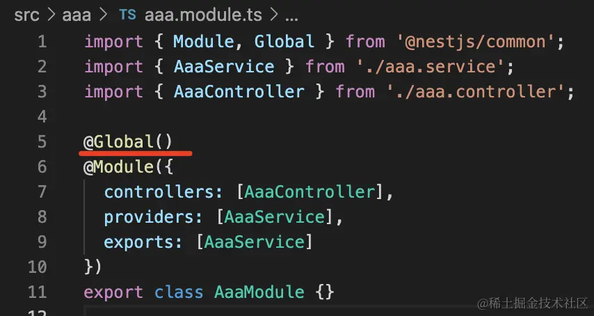
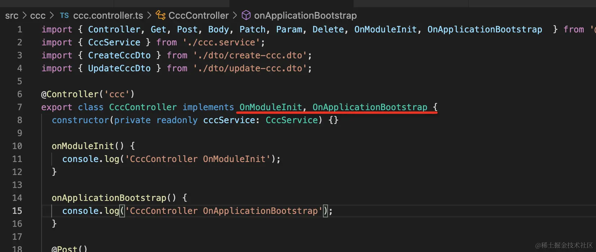
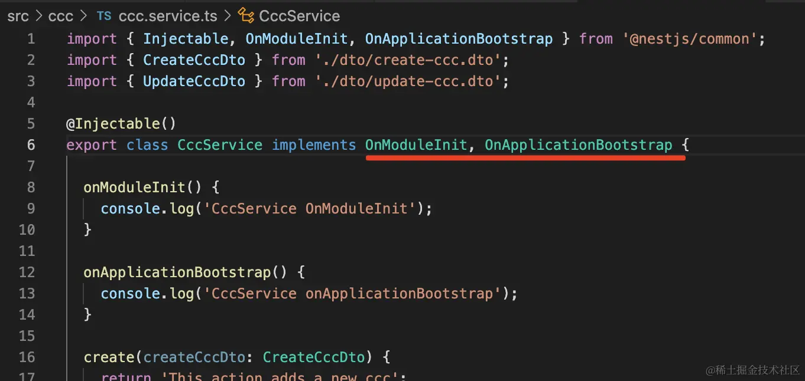
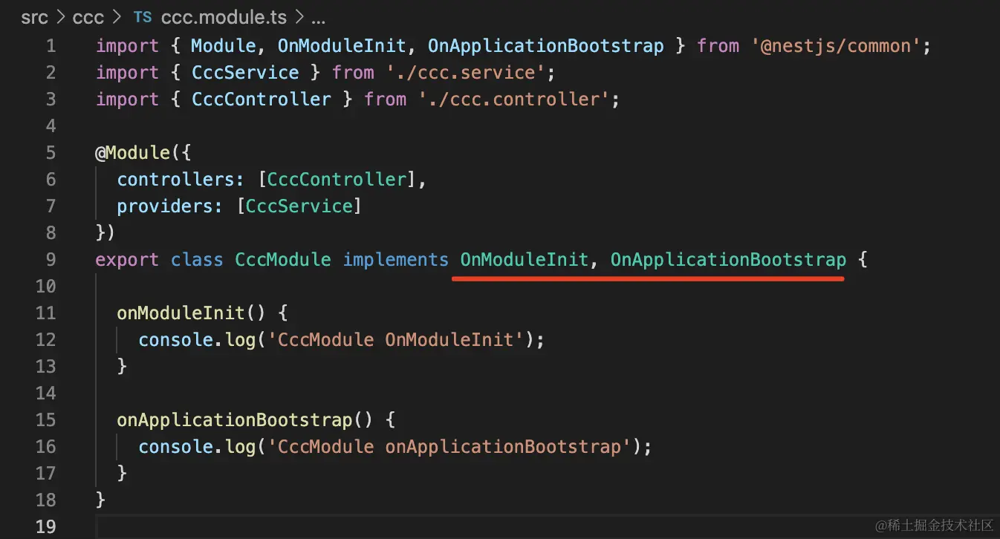

模块导出 provider，另一个模块需要 imports 它才能用这些 provider。

但如果这个模块被很多模块依赖了，那每次都要 imports 就很麻烦。

@Global()直接申明成全局 

BbbModule 无需 imports. 直接在需要使用的地方注入(全局暴露的 AaaService)即可

生命周期：
Nest 在启动的时候，会递归解析 Module 依赖，扫描其中的 provider、controller，注入它的依赖。

全部解析完后，会监听网络端口，开始处理请求。

首先，递归初始化模块，会依次调用模块内的 controller、provider 的 onModuleInit 方法，然后再调用 module 的 onModuleInit 方法。

全部初始化完之后，再依次调用模块内的 controller、provider 的 onApplicationBootstrap 方法，然后调用 module 的 onApplicationBootstrap 方法

然后监听网络端口。

应用销毁的时候也同样有生命周期：

先调用每个模块的 controller、provider 的 onModuleDestroy 方法，然后调用 Module 的 onModuleDestroy 方法。

之后再调用每个模块的 controller、provider 的 beforeApplicationShutdown 方法，然后调用 Module 的 beforeApplicationShutdown 方法。

然后停止监听网络端口。

之后调用每个模块的 controller、provider 的 onApplicationShutdown 方法，然后调用 Module 的 onApplicationShutdown 方法。