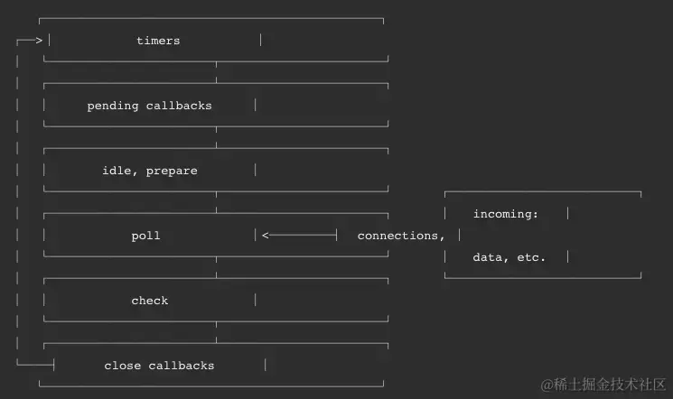

# Node.js 中的事件循环

Node.js 中的事件循环与浏览器中的不同。Node.js 的事件循环分为 6 个阶段，会按照顺序反复执行。每当进入某一个阶段时，都会从对应的回调队列中取出函数去执行。

## 6 个阶段

1. **timers（定时器）**：执行 setTimeout 和 setInterval 回调。
   
2. **pending callbacks（挂起的回调）**：执行推迟到下一个循环迭代的 I/O 回调，比如 fs/http 模块执行的回调。

3. **idle，prepare（空闲/准备）**：内部使用。

4. **poll**：检索新的 I/O 事件；执行 I/O 相关的回调；在适当的时候节点将阻塞在这里。

5. **check**：执行 setImmediate 回调（Node.js 专有方法）。

6. **close callbacks**：一些事件的关闭回调，例如 socket.on('close', ...)。

## 2 个微任务队列

- **nextTick 队列**：存储与 `process.nextTick` 函数相关的回调函数。

- **Promise 队列**：存储与 JavaScript 中的原生 Promise 相关的回调函数。

在这 6 个阶段中并没有显示 `process.nextTick`，虽然它也是异步的，因为从实现上来说它不是事件循环的一部分。在某一操作完成后，将处理 `nextTickQueue`，而不考虑事件循环的当前阶段。在给定阶段调用 `process.nextTick()` 时，在 `process.nextTick()` 触发的所有回调执行之前，事件循环将会停顿。这可能会带来一些极端的情况，通过递归调用 `process.nextTick()` 而使 I/O 停止，可以阻止事件循环进入轮循阶段。

## 执行规则总结

1. 同步代码
2. nextTick 队列
3. Promise.then 队列
4. setImmediate 队列
5. setTimeout 队列
6. 异步读取文件的回调队列
7. exit 关闭队列

其中，nextTick 和 then 属于微任务队列，其余属于宏任务队列。如果执行宏任务队列时，微任务队列有任务，则需要先执行微任务队列，即宏任务队列可以被微任务队列插队。但是两个微任务队列 nextTick 和 then 之间不允许插队。执行 then 时，如果有 nextTick 任务，需要把当前的 then 队列执行完。宏任务队列中，exit 关闭队列无法被微任务队列插队。

