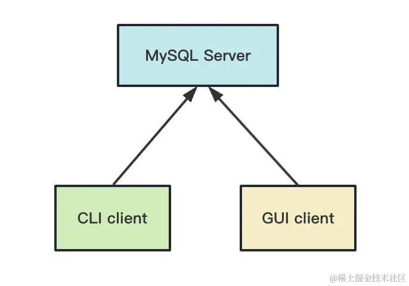
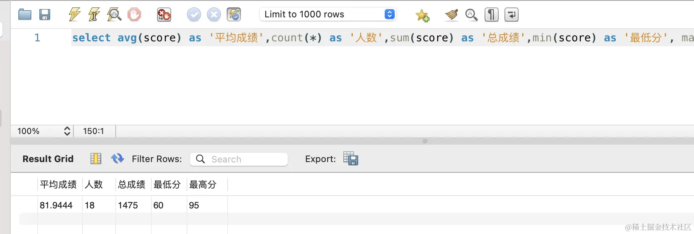
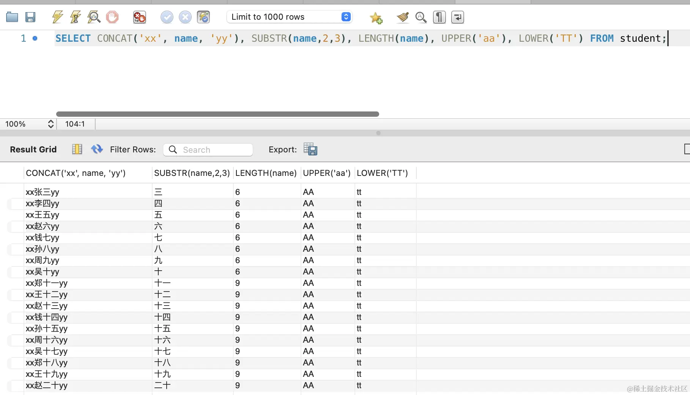
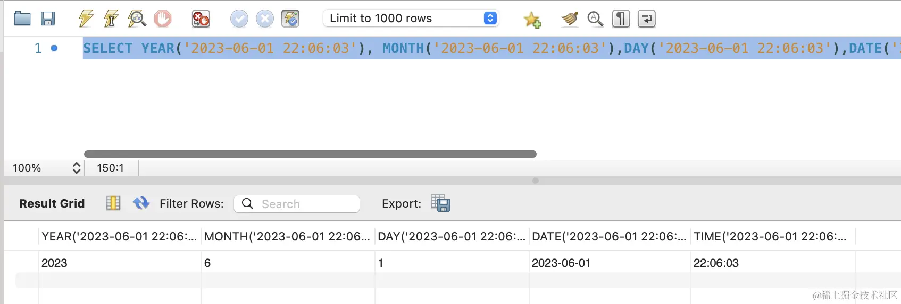
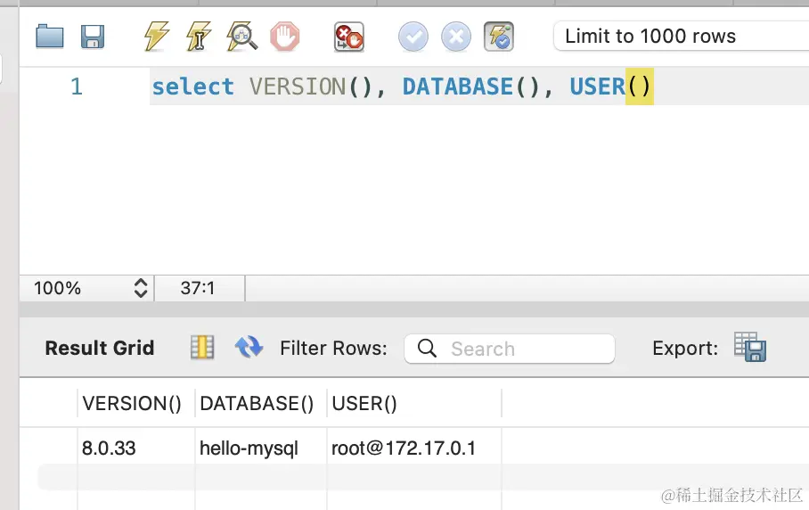

当涉及到后端开发时，主要任务包括从数据库中检索数据并将其返回给前端进行渲染，以及将前端提交的数据存储到数据库中。MySQL 作
为数据库管理系统，分为后台守护进程和客户端两个方面。



### 后端主要任务：

1. 从数据库中检索数据并返回给前端渲染。
2. 将前端提交的数据存储到数据库中。

### MySQL 组成：

- **后台守护进程：** 负责管理数据库的核心服务。
- **客户端：** 通过客户端与数据库进行交互，执行各种操作。

### SQL 的分类：

SQL（Structured Query Language）包括不同类型的命令，根据其功能可以分为以下三种：

1. **DDL（Data Definition Language）：**

   - 用于定义、修改数据库结构的命令。
   - 示例：
     ```sql
     CREATE DATABASE dbname;
     CREATE TABLE tablename (
       column1 datatype,
       column2 datatype,
       ...
     );
     ```

2. **DML（Data Manipulation Language）：**

   - 用于对数据执行操作的命令，包括增加、删除、修改数据。
   - 示例：

     ```sql
     INSERT INTO tablename (column1, column2, ...)
     VALUES (value1, value2, ...);

     UPDATE tablename
     SET column1 = value1, column2 = value2, ...
     WHERE condition;

     DELETE FROM tablename
     WHERE condition;
     ```

3. **DQL（Data Query Language）：**
   - 用于查询数据库中的数据。
   - 示例：
     ```sql
     SELECT column1, column2, ...
     FROM tablename
     WHERE condition;
     ```

以上是 SQL 的主要分类，它们在后端开发中用于管理数据库结构、操作数据以及执行查询操作。

## sql 基础指令 增删改查(CRUD)

1.查询:

```sql
SELECT name,country FROM Websites;
SELECT * FROM Websites;
SELECT DISTINCT column1, column2 FROM table_name;
```

select 后面接字段名,多字段用","分开,from 后面接表名.  
::tips

SELECT DISTINCT 表示查询后接的字段名,需要去重. 如果有多个字段,则选择不同最多的作为列,带出其它相同的列.

"\*" 表示表中的全部字段

2.增加: insert (最低操作一行的数据)

```sql
INSERT INTO table_name(name1,name2,name3)
VALUES (value1,value2,value3,...);
```

insert into 表名 values(value1,value2,value3),如果是要插入一整行的数据,可以不提供列名.

3. 更新: update

```sql
UPDATE table_name
SET column1 = value1, column2 = value2, column3 = value3
WHERE condition;
```

**WARNING: 请一定添加 where 子句,如果没有 WHERE 子句，所有的记录都将被更新！**

4. 删除:delete 因为删除不可逆,请小心使用,可以使用某个字段表示已删除,用 update 状态做逻辑删除 **同 update 一样,没有 where
   将作用全部的行.**

```sql
DELETE FROM 表名 WHERE 条件
```

5. 清空数据表: truncate,表格被清空,但是表格的结构和索引还在.

```sql
TRUNCATE table_name
```

6. 删除表: drop

```sql
DROP TABLE table_name
```

## 条件子句

1. where 后继解后续子句,对查出来的结果,进行筛选出来的

```
SELECT column1, column2 from table_name WHERE condition
```

|等于|不等于|大于|小于|大于等于|小于等于

= != > < >= <=

between: 在某范围之间

like: 搜索某种模式

IN: 对于某一列的多种可能的数据 IN 中的数值都可以被筛出来

## 连接运算符

1. and & or

and 就是多条件连接,多条件都是 true 才可以. or 就是在多条件连接,只要有一条通过,就可以返回数据

```sql
SELECT * FROM Websites WHERE country='CN' AND alexa > 50
```

## 排序方法

ORDER BY 排序查出对应的 ASC 升序(默认值),DESC(降序) 多列排序先拍先出现的,再拍后出现的

```
SELECT column1, column2, ...
FROM table_name
ORDER BY column1, column2, ... ASC|DESC;
```

## 查询条数限制

**不同的数据库,有着不同实现方式. 此处需要区分一下** 虽然差别不大,但是没有统一的规范,也是不合适的.但是没有办法这个特性可
以用来分页,无所手动分页.

```
sql-serve中 支持TOP 支持数据和百分比 后面接列名
SELECT TOP number|percent column_name(s)
FROM table_name;

mysql 中使用limit
SELECT column_name(s) FROM table_name LIMIT number;

Oracle 中使用ROWNUM
SELECT column_name(s)
FROM table_name
WHERE ROWNUM <= number;
```

## 模糊查询:like

在 where 子句中 进行模糊条件筛选

```
SELECT * FROM Websites
WHERE name LIKE 'G%';
```

其中百分号是通配符. G%: 表示以 G 开头 %G: 表示以 G 结尾 %oo%: 表示中间包含 oo not like '%G' :不以 G 结尾

## 通配符

这些前面用 like %: 表示 0 个或多个任意字符

\_: 表示任意一个字符

后面用 REGEXP 方式,使用正则的方式去匹配. REGEXP '^[GFs]' REGEXP '^[!A-H]' 或者'^[^A-H]'

## 查询某个列的多个值

在 where 子句中, 列名 in (1,2,3,4,5) 可能的值. 同理 not in ('一班', '二班');

```
SELECT column1, column2, ...
FROM table_name
WHERE column IN (value1, value2, ...);
```

## 查询某个列的值在两个数之间

在某个值之间: between xx and xx

```
SELECT column1, column2
FROM table_name
WHERE column BETWEEN value1 AND value2;
```

## 表列别名:

很简单,就是列名或者表名的 后面接上 as

```
给列取别名
select column1 as huangxi from table_name

给表正题取别名
select column1 as huangxi from table_name as haungxi_table
```

最后再来过一遍所有的内置函数，函数分为这么几类：
聚合函数：用于对数据的统计，比如 AVG、COUNT、SUM、MIN、MAX。
```sql
select avg(score) as '平均成绩',count(*) as '人数',sum(score) as '总成绩',min(score) as '最低分', max(score) as '最高分' from student 
```

字符串函数：用于对字符串的处理，比如 CONCAT、SUBSTR、LENGTH、UPPER、LOWER。
```sql
SELECT CONCAT('xx', name, 'yy'), SUBSTR(name,2,3), LENGTH(name), UPPER('aa'), LOWER('TT') FROM student;
```

数值函数：用于对数值的处理，比如 ROUND、CEIL、FLOOR、ABS、MOD。
```sql
SELECT ROUND(1.234567, 2), CEIL(1.234567), FLOOR(1.234567), ABS(-1.234567), MOD(5, 2);
```
分别是 ROUND 四舍五入、CEIL 向上取整、FLOOR 向下取整、ABS 绝对值、MOD 取模。

日期函数：对日期、时间进行处理，比如 DATE、TIME、YEAR、MONTH、DAY

条件函数：根据条件是否成立返回不同的值，比如 IF、CASE
if 函数适合单个条件，case 适合多个条件。
```sql
select name, if(score >=60, '及格', '不及格') from student;

SELECT name, score, CASE WHEN score >=90 THEN '优秀' WHEN score >=60 THEN '良好'ELSE '差' END AS '档次' FROM student;

```
系统函数：用于获取系统信息，比如 VERSION、DATABASE、USER。

其他函数：NULLIF、COALESCE、GREATEST、LEAST。

NULLIF：如果相等返回 null，不相等返回第一个值。
COALESCE：返回第一个非 null 的值：
GREATEST、LEAST：返回几个值中最大最小的。


类型转换函数：转换类型为另一种，比如 CAST、CONVERT、DATE_FORMAT、STR_TO_DATE。
```sql
select greatest(1, cast('123' as signed),3);

-- signed：整型；
-- unsigned：无符号整型
-- decimal：浮点型；
-- char：字符类型；
-- date：日期类型；
-- time：时间类型；
-- datetime：日期时间类型；
-- binary：二进制类型

SELECT DATE_FORMAT('2022-01-01', '%Y年%m月%d日');

SELECT STR_TO_DATE('2023-06-01', '%Y-%m-%d');
```


## join 连表查询

join 分为多种类型,就像是集合的交并补集.下面将一一介绍:

1. join 默认类型 -- inner join

** 如果只使用 join 不加其他的描述,就是 inner join**

```sql
SELECT * FROM SecurityPatrolRecords as table1 INNER JOIN SecurityPatrolRecordItems as table2
ON table1.id = table2.RecordId where table1.State = 1
```

通过 inner join 是取两者的交集$A∩B$. 即两者共有的那一份.

2. LEFT JOIN (左 join)

**即将左表全部返回行,右边如果能配上就返回值,配不上就返回 null**

```sql
SELECT * FROM SecurityPatrolRecords as table1 INNER JOIN SecurityPatrolRecordItems as table2
ON table1.id = table2.RecordId where table1.State = 1
```

3. RIGHT JOIN (右 join)

**即将右表全部返回行,左边如果能配上就返回值,配不上就返回 null,和上面的左 join 几乎一样**

4. FULL OUTER JOIN 全部连接 FULL OUTER JOIN 关键字只要左表（table1）和右表（table2）其中一个表中存在匹配，则返回行.匹配
   的返回可以连接的值,不匹配的按单表展示,其余地方返回 null 还是比较好理解的.

## 连接查询出来的数据 UNION

**UNION 合并时,需要保证列的数量相同,以及列的数据结构相似.比如都是字符串类型,就可以合并,不同的长度类型是没有关系的**
UNION 和 UNION ALL: UNION 连接后的查询表 是去重后的, 而 UNION ALL 连接的查询表 是未去重的.

UNION 连接时会将表中的重复数据都给去掉,包括原本单表中的重复数据如果有多个字段,有的重复,有的不重复. 就一不重复为准. 只要
查出的行还有不一样的,就会去掉


## 创建数据库

创建名字为 my_dbxxx 的数据库

```
CREATE DATABASE my_dbxxx;
```

## 创建数据表

创建一个数据表 table_namexxx,并同时初始化表的项,用()包裹,然后是列名,后接一个空格 然后再跟上一个数据类型

```
CREATE TABLE table_namexxx
(
column_name1 data_type(*size*),
column_name2 data_type(*size*),
column_name3 data_type(*size*),
....
);
```

## 给表中数据添加约束条件

有了数据类型后,还需要对数据做判断是否可空,是都唯一等其他判断. 直接添加在建表的类型后面即可.

```
CREATE TABLE Persons (
ID int NOT NULL,
LastName varchar(255) ,
FirstName varchar(255) ,
Age int );
```
