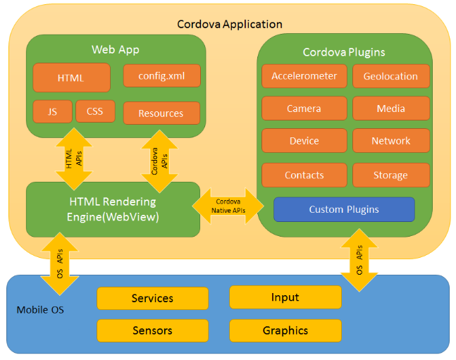
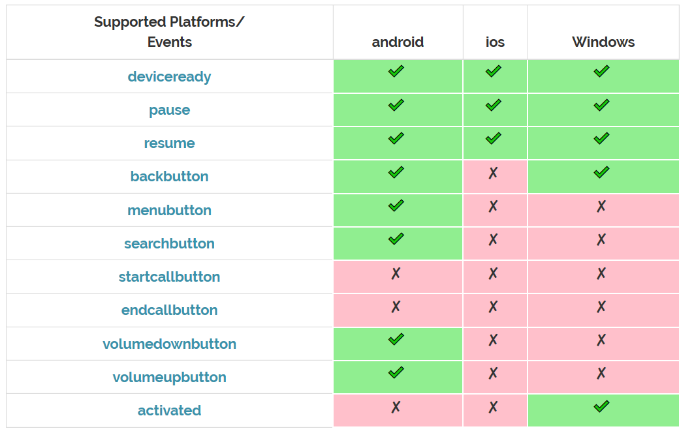

## cordova框架一览

### Cordova简介
Adobe把PhoneGap的核心代码贡献给了Apache软件基金会，但保留了PhoneGap的商标所有权。Apache将PhoneGap核心代码命名为Apache Callback项目，后又更 名为Apache Cordova。
cordova是一个开源的移动(`webview`)开发框架。允许你用标准的web技术-HTML5,CSS3和JavaScript做跨平台（android、ios、windows等）开发。应用在每个平台的具体执行被封装了起来，并依靠符合标准的API绑定去访问每个设备的功能，比如说：传感器、数据、网络状态。

**整个cordova包含三部分：web app、webview和plugins。 其中web app是可以自己开发的web代码，webview是针对每个平台开发的浏览器引擎，plugins是cordova针对手机硬件（如相机、电池、存储等）解耦出来的插件组合。**


### cordova常用指令
1. 检查安装组件是否符合要求 `cordova requirements`
2. 添加或删除支持的平台 `cordova platform add/remove android`
3. 编译安卓平台代码 `cordova build android`
4. 安装与卸载插件命令 `cordova plugin add/remove cordova-plugin-xxxx`

### 配置文件

#### 1、hooks目录
存放自定义cordova命令的脚本文件。每个project命令都可以定义before和after的Hook，比如：before_build、after_build。
#### 2、platforms目录
各个平台的原生代码工程，不要手动修改，因为在build的时候会被覆盖
#### 3、plugins目录
插件目录
#### 4、www目录
源代码目录，在cordovaprepare的时候会被copy到各个平台工程的assets\www目录中。其中index.html为应用的入口文件
特定平台工程和Cordova工程都包含了configxml文件： Cordova工程中的configxml,是一些跨平台的通用配置。 特定平台工程中的configxml,除了包含通用配置，还有一些平台的特性化配置，比如：引用插件、插件的加载执行方式等等。

### cordova启动流程
启动步骤如下：
a、启动原生代码
b、splash screen,刷新屏幕
c、加载html，顺序执行js代码
d、等待$(ducument).ready()执行，但执行完后cordova的插件不一定可用，因为cordova.js是异步执行的。
e、注册deviceready事件，该事件触发表明所有cordova api已经全部完成加载，此时使用cordova插件才是安全的。


### hooks开发
**Hooks本身是一些脚本代码，可以使用任何语言（例如：bat,shell等）,用来自定义Cordova CLI命令。 所有的脚本文件必须放在CordovaCLI命令对应的before或after文件夹中。如：**
`hooks/before_xxx`
`hooks/after_xxx`
**其中xxx就是Cordova对应的命令，比如：run、build等**

#### 添加步骤：
1、修改全局config.xml文件，在对应的platform节点下添加hook：
```xml
<platform name-"android">
    <hook type="before_run" src="hooks/before_run/android/beforeRun.sh"/>
</platform>
```
2、在该路径下编写hook脚本,实现想要的逻辑了。


### cordova插件使用方法
插件有很多，如电池、相机、震动、媒体、网络、设备等，但每个插件的使用和调用类似，这里以电池插件为例。

安装与卸载电池插件命令：
```sh
   cordova plugin add/remove cordova-plugin-battery-status
```

电池插件提供了3个监听事件：
   `batterystatus`
   `batterycritical`
   `batterylow`

**对于batterystatus事件，调用方式如下，回调函数中会返回一个status对象，这个对象包含status.level和status.isPlugged两个参数，前者表示电池状态，即电量百分比，后者表是否在充电状态。**

```ts
window.addEventListener("batterystatus", onBatteryStatus, false);

function onBatteryStatus(status) {
    console.log("Battery Level Low: " + status.level + "isPlugged" + status.isPlugged);
}
```


### cordova事件

各平台支持的事件如上表：
`Deviceready`:  cordova api全部加载完毕以后触发该事件，只有该事件触发后，调用api才是安全的。
`Pause`: 后台挂起事件
`Resume`: 挂起后返回事件
`Backbutton`: 返回事件

**调用事件的代码**
*注册deviceready事件如下，只有注册了deviceready事件后，其它事件如pause事件和插件才可用;*
```ts
document.addEventListener("deviceready", onDeviceReady, false);

function onDeviceReady() {
   document.addEventListener("pause", onPause, false);
   
   function onPause() {
   //挂起后逻辑
   }
}
```