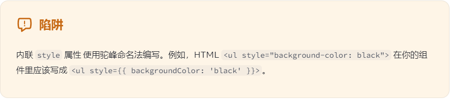

```jsx
return (
  <div>
    
  </div>
);
```

1. 导出多行的组件时,需要添加括号

2. html 标签是小写, 组件名首字母大写

3. 组件可以渲染其他组件，但是 请不要嵌套他们的定义,你应该在顶层定义每个组件. 组件就是返回 jsx 的函数.函数名字也是大写开
   头

```jsx
   export default function Gallery() {
     // ...
   }

    function Profile()
```

挑战 1:

```jsx
//导出组件
export default function Profile() {
  return ;
}
```

挑战 2:

```jsx
//修复返回语句
export default function Profile() {
  return ;
}
```

挑战 3:

```jsx
// React 是如何区分组件和常规的 HTML 标签
function Profile() {
  return ;
}

export default function Gallery() {
  return (
    <section>
      <h1>了不起的科学家</h1>
      <Profile />
      <Profile />
      <Profile />
    </section>
  );
}
```

挑战 4:

```jsx
// 自定义组件
export default function App() {
  return <h1>干得漂亮！</h1>;
}
```

2. 导入导出

```jsx
// 进一步拆分组件
// App.js
import Gallery from './Gallery.js';

export default function App() {
  return (
    <div>
      <Gallery />
    </div>
  );
}

//  Gallery.js
import {Profile} from './Profile'

export default function Gallery() {
  return (
    <section>
      <h1>了不起的科学家们</h1>
      <Profile />
      <Profile />
      <Profile />
    </section>
  );
}

// Profile.js
export function Profile() {
  return (
    
  );
}
```

```
哪里可以使用大括号

用作 JSX 标签内的文本：<h1>{name}'s To Do List</h1> 是有效的，但是 <{tag}>Gregorio Y. Zara's To Do List</{tag}> 无效。

用作紧跟在 = 符号后的 属性：src={avatar} 会读取 avatar 变量，但是 src="{avatar}" 只会传一个字符串 {avatar}。

除了字符串、数字和其它 JavaScript 表达式，你甚至可以在 JSX 中传递对象。对象也用大括号表示，例如 { name: "Hedy Lamarr",
inventions: 5 }。因此，为了能在 JSX 中传递，你必须用另一对额外的大括号包裹对象
：person={{ name: "Hedy Lamarr", inventions: 5 }}。
```

你可能在 JSX 的内联 CSS 样式中就已经见过这种写法了。React 不要求你使用内联样式（使用 CSS 类就能满足大部分情况）。但是当
你需要内联样式的时候，你可以给 style 属性传递一个对象：



### 给 prop 指定一个默认值

```jsx
function Avatar({ person, size = 100 }) { // ... }

// 默认值仅在缺少 size prop 或 size={undefined} 时生效。 但是如果你传递了 size={null} 或 size={0}，默认值将 不 被使用。
```

### 使用 JSX 展开语法传递 props

```jsx
// 当这个组件,不需要任何props,直接使用展开语法,直接使用 ...props
function Profile(props) {
  return (
    <div className="card">
      {" "}
      <Avatar {...props} />{" "}
    </div>
  );
}
```

### 将 JSX 作为子组件传递

**相当于 vue 中的插槽**

```jsx
// 已测试,必须使用children,否则无效
function Card({ children }) {
  return <div className="card">{children}</div>;
}
```

### 条件渲染

```jsx
// 根据不同条件,返回不同的jsx. 不返回jsx 就返回 null
if (isPacked) {
  return null;
}
return <li className="item">{name}</li>;

// 只有isPacked为真时,才会渲染
return (
  <li className="item">
    {name} {isPacked && "✔"}
  </li>
);
```
