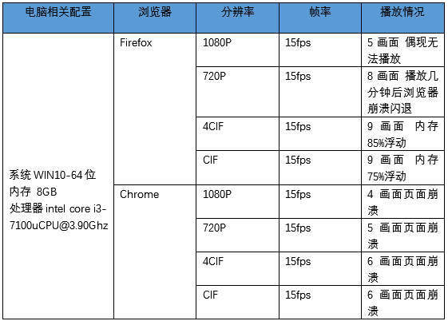

**电脑性能要求**



1. 安装依赖
```sh
npm install ezuikit-js

2.需要的页面直接引入
```vue
<!-- 创建DOM -->
<template>
  <div id="video-container"></div>
</template>

<script>
import EZUIKit from 'ezuikit-js';

export default {
  name: "videoContainer",
  data() {
    return {
      player: null
    };
  },
  methods: {
    initPlayer() {
      this.player = new EZUIKit.EZUIKitPlayer({
        id: 'video-container', // 视频容器ID
        accessToken: 'at.bgzqqs7p1gky5crv98mak9z37ravtpay-99tgbid6eb-1ddkfmr-ymyxl39lx',
        url: 'ezopen://open.ys7.com/FB9857503/1.hd.live',
        template: 'standard',
        header: ['capturePicture', 'save', 'zoom'],
        footer: ['talk', 'broadcast', 'hd', 'fullScreen'],
        plugin: ['talk'],
        audio: 1,
        handleSuccess: () => {
          console.log('handleSuccess');
        },
        handleError: () => {
          console.log('handleError');
        },
      });
    }
  },
  mounted() {
    this.$nextTick(() => {
      this.initPlayer();
      this.player.play();
    });
  }
};
</script>
```

**对接超级简单,直接就okay了**

### 下面是详细的文档
| 参数名        | 类型     | 描述                                                                                            | 是否必选 |
| ------------- | -------- | ----------------------------------------------------------------------------------------------- | -------- |
| id            | String   | 播放器容器DOM的id                                                                               | Y        |
| accessToken   | String   | 授权过程获取的access_token                                                                      | Y        |
| url           | String   | 视频zopen协议播放地址                                                                           | Y        |
| audio         | int      | 是否默认开启声音 1: 打开（默认）0: 关闭                                                         | N        |
| width         | int      | 视频宽度，默认值为容器宽度                                                                      | N        |
| height        | int      | 视频高度，默认值为容器高度                                                                      | N        |
| template      | string   | 播放器模板，可选值：`simple`极简版, `standard`标准版, `security`安防版, `voice`语音版           | N        |
| header        | Array    | 视频顶部可选UI组件，可选值：`capturePicture`截图, `save`录像保存, `zoom`电子放大                | N        |
| footer        | Array    | 视频底部可选UI组件，可选值：`talk`对讲, `broadcast`语音播报, `hd`高清标清切换, `fullScreen`全屏 | N        |
| plugin        | Array    | 按需加载插件，可选值：`talk`对讲                                                                | N        |
| handleSuccess | function | 播放成功回调                                                                                    | N        |
| handleError   | function | 播放错误回调                                                                                    | N        |

---

| 方法名           | 类型     | 描述                             | 使用示例                    |
| ---------------- | -------- | -------------------------------- | --------------------------- |
| stop             | function | 结束播放                         | `player.stop()`             |
| openSound        | String   | 开启声音                         | `player.openSound()`        |
| closeSound       | String   | 关闭声音                         | `player.closeSound()`       |
| startSave        | int      | 开始录像                         | `player.startSave()`        |
| stopSave         | int      | 结束录像                         | `player.stopSave()`         |
| capturePicture   | function | 视频截图                         | `player.capturePicture()`   |
| fullScreen       | function | 全屏（自动适配移动端和PC端全屏） | `player.fullScreen()`       |
| cancelFullScreen | function | 取消全屏                         | `player.cancelFullScreen()` |
| getOSDTime       | function | 获取播放时间回调                 | `player.getOSDTime()`       |
| startTalk        | function | 开始对讲                         | `player.startTalk()`        |
| stopTalk         | function | 结束对讲                         | `player.stopTalk()`         |