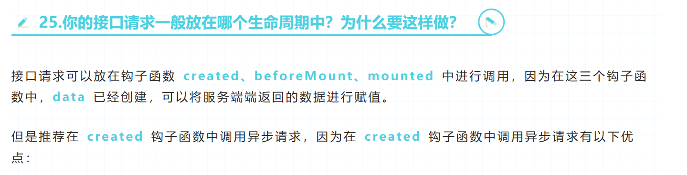

第一个面试题

1. mjs和cjs 的区别.(不知道)
2. 工程化相关的问题. 实际项目中你有没有遇到node版本不兼容的问题. 你是怎么解决的 ? nvm包管理器. (知道不多)  
3. 你之前工作过的公司的 你开发完成后的流程是什么样的? 后续的(直接打包就提交,项目规模较小)
4. git 常用指令.(了解)
``` sh
git branch 查询所有分支
git branch 分支名 新建分支
git checkout branch名 切换分支.
```
5 vue2,vue3 怎么全局注册指令 (不知道)
Vue.directive('focus', {
  // 当绑定元素插入到 DOM 中。
  inserted: function (el) {
    // 聚焦元素
    el.focus();
  }
});
6. 项目中生命周期执行的生命周期 (知道)

7. v-model 语法糖的本质
 不知道

第二个人:
1. 你平时常用的包管理器有哪些. npm yarn pnpm 幽灵依赖问题 你知道么?  
2. 什么是闭包? 怎么清除闭包. (知道) 
3. 项目难点 是介绍在路由守卫里面加载 动态加载路由.(难点不高)
4. 收集表单的项目,较为简单. 不支持版本管理.  
5. ts中什么是联合类型和交叉类型? (知道)
6. 深拷贝(了解)
7. webpack(不知道,没有配置过loader及plugins)
8. 小程序原生开发. 
9. 会写jsp(比较早的项目)
10. node了解不多.


第三个人:
1. js 基础数据类型. (知道)
2. 浏览器全局对象是 `window`，Node.js 中是 `global`。全局属性 `globalThis` 在浏览器和 Node.js 环境下都指向全局对象。(不知道)
3. 什么是闭包? 怎么清除闭包. (半知道,不如第二个的解释) 
4. 写过eletron,知道主线程和渲染线程的IPC通信,但是不知道预处理脚本.node了解过一些.了解http,fs模块. 但是他不知道模块化.commjs模块化. (应该没有系统学习过)
5. promise的状态,promise的静态方法基本使用(知道)
6. css中盒模型和BFC(了解,BFC了解)
7. 项目前端优化(了解一点,常规的)
   ```
   1. v-if v-show
   2. 图片按需加载
   3. 按需导入
   4. cdn
   ```
8. 深拷贝(了解)
9. uniapp 做过Android和ios的打包,会原生小程序(说到了条件编译)
10. axios 拦截器了解.但是
11. v2 v3的响应式原理,(知道的). v2的重新附加响应式(知道的). Object.defineProperty Proxy API记的挺清楚的.
12. 101 HTTP状态码 不知道的 说明没有做过websocket
13. 知道怎么处理开发跨域.(转发, 没有说到CROS请求头设置的方案)
14. git命令 用的可视化操作. 命令不记得.(理解)
15. 常用flex布局. 不怎么使用grid布局
16. 原型链 (大致了解 __proto__ ,prototype)
17. eventLoop 事件循环. (了解) 宏任务和微任务大致了解,但是说反了. 