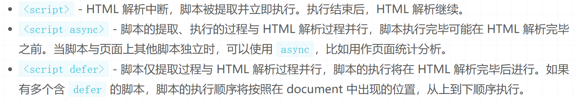
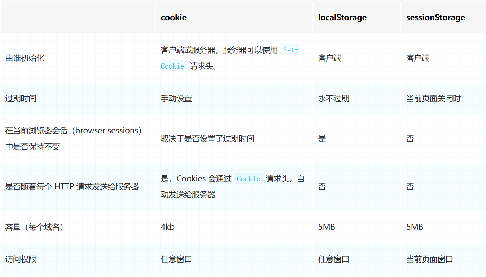

### html 部分
#### 基础题
1. cookie、sessionStorage 和 localStorage 的区别? 6  5  10
<
#### 进阶题
1. script、script async 和 script defer 的区别? 0

1. iframe用过么? 在iframe怎么能拿到父级的信息? 3

### 项目实战题 
1. Vscode中 怎么快速生成一个 html的基础模板.  0
答案: "!" + "enter"


### CSS 部分
#### 基础题
1. Less,Scss,Sass的区别.简单的描述几点? (了解变量,嵌套.听说过`stylus`加分,说明了解的挺广.) 2
#### 进阶
1. Tailwind CSS,unoCSS 你了解么? 能简单描述一下么?  0 (flex:4)
2. 浏览器打印的时候,可以通过什么CSS属性来进行元素分页? 4 world - 黄航.
3. `flex` 和 `gird` 布局了解么? (了解flex通过,熟练使用`grid`加分) 6 
答:`page-break-after: always;`
### 项目实战题
1. 在项目中,你遇到过一些项目使用的是 node-sass. 无法安装依赖的情况? 你是如何解决的嘞? 3
   答: 使用.npmrc规则文件,走镜像下载. (单纯改包管理镜像无效)

### js部分
#### 基础题
1. setTimeout 的返回值是什么,了解么? 4  二: 
2. async/await 你使用过么? 跟promise有什么区别? 1 4
3. es6的新语法: new set()
4. 解构赋值 2
```js
const { firstName : fname, lastName : lname } = person; 二: 0 

// 若是对数组进行对象的解构.会得到什么值么? 
```
4. 模板字符串 `${}` 4
5.  展开运算符 `...{}` 通常用来干什么的. 他是浅拷贝还是深拷贝. 0 二: 4
#### 进阶题
1. Promise的静态方法使用? Promise.all Promise.race (就okay了) 0 3 all 不太清楚 二:3
2. Object.groupBy() 你知道 JS 有这个方法么? 0
3. 0.1 + 0.2 === 0.3 么? 他只有js会出现这个问题,其他语言会出现么? `IEEE754`的浮点数精度问题. 了解

### TS部分

#### 进阶
1.协变、逆变、双变和抗变的理解？()

### vue部分
#### 基础部分
1. vue的路由有那两种模式? 能简单介绍一下么?  了解的 3+ 3
2. nextTick 这个你使用过么? 什么情况会用到他 了解到
3. keep-alive 这个你知道吧. 那怎么设置哪些页面缓存,哪些不缓存嘞? 激活和失活的生命周期hook能说出来么?  了解 6
```js
activated / deactivated
```

#### 进阶题
`vue3.2 setup`语法糖中,父组件想要直接调用子组件的方法. 需要子组件怎么做?  0
```js
// 调用宏定义defineExpose方法.对外暴露
defineExpose({
  state,
  submit
});
```

#### 项目题
1. 你在项目中是怎么下载文件的? 怎么较少一下么? 文件流. 
```
type: 'text/csv;charset=utf-8' 使用bolb
```

### 拓展题(知道的,说明经常关注前端的新消息)
1. 听说过Nuxt,Next,Nest框架么? 他们是用来干嘛的?
2. 使用过websocket eletron 么? 


### 其他题
1. 我看你最近一下,在百得思维的工作时间有点短,方便说下为什么离职么?
2. 我看你在项目中使用了,qiankun这个微前端的技术方案. 你们配合webpack用的还是vite用的嘞. 
能大致讲解一下 qiankun 中的样式隔离的方案么? 

React 组件的生命周期
React 组件传值


在项目中怎么规范人员使用的包管理器?
```
preinstall 不知道
```
项目依赖:only-allow

1. Electron 你是怎么实现项目的 自动更新的?

2. Sass Scss 
   小程序分包 不记的 没做过

3 部分后端.

eletron 不熟悉

图片清晰度
画一个三角形


1. 开发人员调试工具? vue的开发调试工具用过吧.
怎么快速找到页面里这个组件的源代码?

2. 小程序用到wx.login了么? 他的登录流程是什么样的 
3. 使用 CryptoJS 进行登录加密 你这边是怎么加密的? 好的.
4. 使用 canvas 生成对应职位海报并附加对应分享人? 能详细说一下怎么分成的嘛.


js基础比较扎实.
数组记的.
commjs es6


electron不会的.

vue 生命周期 8
react 通信方式. (函数式)
1.props
2.全局
3. Context

4.全局指令. 6了解

项目压缩. 
1.压缩 gzip nginx开启
2.减少请求. (包依赖)
3.懒加载.
4.图片压缩.

1.加班.
加班情况: 2h
1. 入职 (一周内)


webpack 处理静态资源.


vue2 的缺陷

vue-router 有哪些? ( 知道不多)

scss sass 不清楚 (嵌套 css不知道)

文件流 不知道

项目优化 打包及调优
1. 不知道.

2.vscode

加班: 了解
入职时间: 随时


### 10/18日下午.
1. 讲解一下防抖节流的含义和实现原理?
2. 项目有什么难点和亮点?
3. React.useCallback()  React.useMemo() 的区别
4.  call、apply、bind的区别

5. ts的编译指令. 你还记得么?
6. type 和 interface的异同?
```
type 可以作用于原始值，联合类型，元组以及其它任何你需要手写的类型。
合并重复声明: interface 重复声明就会合并，type 不支持，会给你报个错

关键区别在于 interface 主要用于描述一个对象。
type 是类型别名，用于给各种类型定义别名，联合类型 或者 元组类型，
```

7.我们做项目时,不是需要引入项目的依赖迈? 比如我们导入一个dayjs的依赖. 
import dayjs from 'dayjs'
node的路劲查找策越是怎么去找到 这个依赖的源文件的.

8. 怎么纯前端的版本检测方案? 检测到有新的版本后,就弹窗提醒用户刷新. 
###

flex布局?有了解吗. 你记得有哪些属性么? 
怎么切换主轴方向.

BFC你了解么? (块级格式化上下文) 
开启:
```
1.浮动元素 float : xxx    xxx 不是 none

2.绝对定位元素 position： absolute 或 fixed

3. 块级元素 overflow : xxx  xxx 不是 visible

4.display : flex 或 inline-block
```
处理问题
父元素高度塌陷、浮动元素覆盖、外边距折叠等问题

checkbox组件 他 @change事件.. 我想在事件触发的时候,在他原本已经有一个参数. 好需要传递一个参数给他. 
我需要怎么处理,才能保证他原来的参数.

$event,
二.JS的进阶题?
const a = {} valueOf toString

(a==1 && a==2 && a==3)